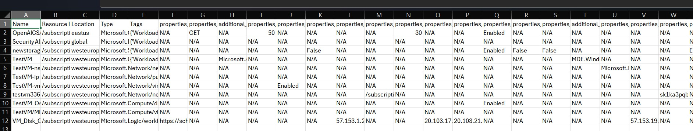
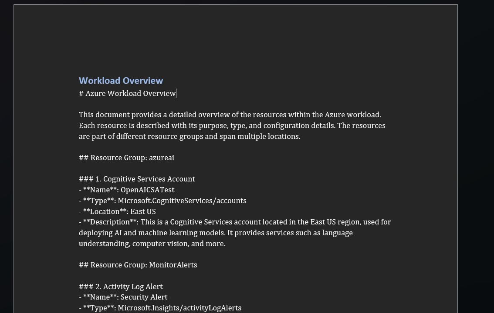
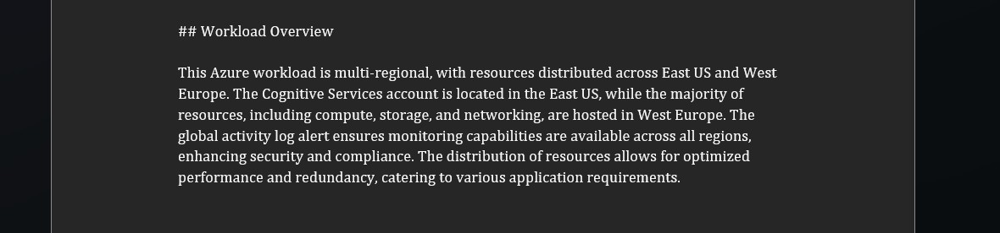

# Azure Resource Metadata Analyzer V0.2

## Overview

**Azure Resource Metadata Analyzer** is a Python-based tool designed to automate the discovery, documentation, and analysis of Azure resources based on specific tags. It retrieves metadata, organizes it in a structured CSV file, and generates a comprehensive DOCX report with human-readable descriptions and architecture overviews using OpenAI.

The goal of this project is to provide an automated way to gather and document Azure resources for better analysis, reporting, and optimization. We also invite contributions from the community to extend the tool with new features and improvements, in line with the continuous development model (Artifact).

## Project Objective
The goal of the project is to give a basis on which you can then develop and obtain information as needed. The project is granted “as is” and there is no guarantee of support. Contributors are invited to participate in the project to add new features and possibly make up for features not currently present.

## Script Objectives

The key objectives of the Azure Resource Metadata Analyzer are:
- Automatically discover Azure resources tagged with specific metadata.
- Extract and store resource metadata in a structured CSV format, expanding nested properties into separate columns for detailed analysis.
- Generate human-readable reports in DOCX format for both technical and non-technical stakeholders.
- Use OpenAI's API to generate descriptions and architecture overviews for each resource based on the extracted metadata.

## Features

- **Azure Resource Discovery:** Automatically discover Azure resources based on a specific tag (e.g., `Workload=Production`).
- **CSV Metadata Export:** Store metadata for each resource, including expanded nested properties, in a structured CSV format.
- **DOCX Report Generation:** Create detailed reports in DOCX format with an overview of the workload and detailed information about each resource.
- **OpenAI Integration:** Automatically generate human-readable documentation using OpenAI’s GPT models to describe the architecture and key features of each resource.
- **Expandable:** The project is designed to be modular and invites the community to add new features and optimizations.

## Technologies Used

- **Python**: The primary programming language for the project.
- **Azure SDK for Python**: To interact with Azure resources and retrieve metadata.
- **OpenAI API**: Used to generate descriptive and human-readable documentation for each resource.
- **CSV**: To store metadata in a structured format.
- **DOCX (via python-docx)**: To generate Word documents summarizing the architecture and resource details.
- **PyCharm**: As the development environment used for this project.

## Setup

To set up and run the project, follow these steps:

### Prerequisites

- **Python 3.8+** installed on your machine.
- An **Azure Service Principal** with permissions to read Azure resource information.
- An **OpenAI API key**.

### Installation

1. **Clone the Repository**:
    ```bash
    git clone https://github.com/yourusername/azure-resource-metadata-analyzer.git
    cd azure-resource-metadata-analyzer
    ```

2. **Install Required Python Packages**:
    Use the following command to install the required dependencies:
    ```bash
    pip install -r requirements.txt
    ```

3. **Configure Your Azure and OpenAI Credentials**:
    Update the script with your Azure Service Principal credentials and OpenAI API key:
    ```python
    tenant_id = '<replace with tenant id'
    client_id = '<replace with app client id>'
    client_secret = '<replace with secret>'

    API_KEY = "<replace with api key for OpenAI>"
    QUESTION_ENDPOINT = "<replace with OpenAI endpoint"

    ```

### Running the Script

1. **Run the Script**:
    You can run the script with the following command:
    ```bash
    python Azure Resource Metadata Analyzer.py
    ```

2. The script will generate:
   - A CSV file (`resources_with_expanded_metadata.csv`) containing detailed metadata for each discovered resource.
   - A DOCX file (`Output.docx`) with an overview and detailed report of the resources and their architecture.


### Output Example

- **CSV File**: The CSV file contains detailed information about each Azure resource, including expanded nested properties. The CSV will add dinamically column based on resource properties. Huge column with a lot of properties are expected. Use this file for local query and filtering.
  
- **DOCX File**: The DOCX file provides an overview of the workload and detailed architecture descriptions for each resource, powered by OpenAI.
  
  

## Contributing

Contributions to the project are highly encouraged! Here are some ways you can contribute:
- **Feature Enhancements**: Add new features like additional Azure resource types or more detailed report generation.
- **Performance Improvements**: Help optimize the resource discovery and metadata extraction process.
- **Bug Fixes**: Identify and fix bugs to improve the stability of the project.
- **Documentation**: Improve the README, add more detailed instructions, or contribute to the docstrings in the code.

### How to Contribute

1. Fork the repository.
2. Create a new branch for your feature or bug fix:
    ```bash
    git checkout -b my-new-feature
    ```
3. Commit your changes:
    ```bash
    git commit -am 'Add some feature'
    ```
4. Push to the branch:
    ```bash
    git push origin my-new-feature
    ```
5. Submit a pull request and explain your changes.

We value all contributions and aim to maintain a collaborative, open-source environment where everyone can participate and improve the project.

## License

This project is licensed under the MIT License - see the [LICENSE](LICENSE) file for details.

---

*Azure Resource Metadata Analyzer is a continuous improvement project (Artifact) built to automate Azure resource documentation and reporting. The heart of the project are the community. We invite contributions and encourage innovation through new feature suggestions and performance optimizations.*

## Version Hystory

- V0.2: Add multi-sub assessment
